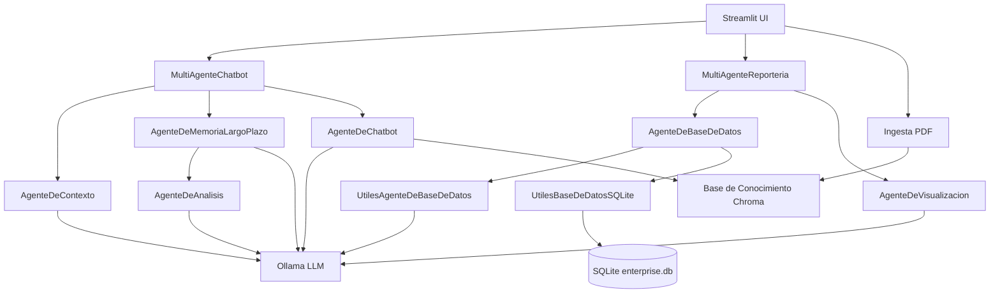

# Proyecto Agente On Premise

Sistema on-premise de IA generativa con flujo multi-agente para chatbot y reporteria. Integra RAG con base de conocimiento (ChromaDB), consultas a SQLite y generacion de reportes HTML. Incluye UI en Streamlit para operar el chatbot, generar reportes y administrar utilitarios (ingesta de PDFs y creacion de BD de prueba).

## Arquitectura (diagrama de agentes)



## Agentes (descripcion)

- **AgenteDeContexto**: valida si el mensaje cumple reglas de contexto (formalidad, respeto, tema). Devuelve un JSON con el estado.
- **AgenteDeMemoriaLargoPlazo**: detecta informacion relevante del usuario (nombre, edad, sexo) para persistencia.
- **AgenteDeAnalisis**: normaliza y da coherencia a la informacion almacenada para evitar contradicciones.
- **AgenteDeChatbot**: responde al usuario usando el LLM y memoria de corto plazo (y opcionalmente contexto desde la base de conocimiento).
- **AgenteDeBaseDeDatos**: convierte lenguaje natural a SQL, ejecuta consultas y analiza resultados.
- **AgenteDeVisualizacion**: genera un reporte HTML con resumen, tabla y grafico a partir de datos.
- **AgenteGenerativo**: crea funciones de codigo en un lenguaje/tema especifico (utilitario).

## Clases principales (resumen)

- **MultiAgenteChatbot** (`src/multiagent/MultiAgenteChatbot/MultiAgenteChatbot.py`): orquesta el flujo conversacional y nodos del grafo.
- **FlujoMultiAgenteChatbot** (`src/multiagent/MultiAgenteChatbot/FlujoMultiAgenteChatbot.py`): define el grafo LangGraph con rutas condicionales.
- **NodosMultiAgenteChatbot** (`src/multiagent/MultiAgenteChatbot/NodosMultiAgenteChatbot.py`): implementa cada nodo (contexto, memoria, chatbot).
- **MultiAgenteReporteria** (`src/multiagent/MultiAgenteReporteria.py`): coordina consultas a BD y generacion de reportes.
- **UtilesAgenteDeBaseDeDatos** (`src/agent/AgenteDeBaseDeDatos/UtilesAgenteDeBaseDeDatos.py`): prompt para SQL y analisis de resultados.
- **UtilesBaseDeDatosSQLite** (`src/agent/AgenteDeBaseDeDatos/UtilesBaseDeDatosSQLite.py`): acceso a SQLite (esquema, consultas).
- **util_ia_onpremise** (`src/util/util_ia_onpremise.py`): funciones comunes (LLM, embeddings, RAG, BD de prueba, memoria de usuario).
- **UI Streamlit** (`src/app.py`): interfaz grafica con chatbot, reporteria y utilitarios.

## Variables de configuracion (principales)

Definidas en `src/conf/conf.py`:

- `CONF_NOMBRE_PROYECTO`: nombre visible del proyecto.
- `CONF_MODEL`: modelo LLM (Ollama) a utilizar.
- `CONF_MODEL_EMBEDDING`: modelo de embeddings para RAG.
- `CONF_SERVICE`: URL del servicio Ollama (por defecto `http://localhost:11434`).
- `CONF_KEEP_ALIVE`: tiempo de vida del modelo en RAM/VRAM (segundos).
- `CONF_BASE_DE_CONOCIMIENTO_NOMBRE`: nombre de la coleccion en Chroma.
- `CONF_BASE_DE_CONOCIMIENTO_RUTA`: carpeta persistente de Chroma.
- `CONF_BASE_DE_CONOCIMIENTO_COINCIDENCIAS_MAXIMAS`: top-k de recuperacion.
- `CONF_BASE_DE_DATOS_RUTA`: ruta del archivo SQLite.
- `CONF_BASE_DE_CONOCIMIENTO_USUARIOS`: carpeta para memoria de usuarios.
- `CONF_RUTA_REPORTES`: carpeta donde se guardan los reportes HTML.

## Ejecucion

```bash
pip install -r requirements.txt
streamlit run src/app.py
```

## Notas

- La BD SQLite se llena solo al usar el boton **Crear base de datos de prueba**.
- La base de conocimiento se llena al ingerir PDFs en la UI.

# Variables de entorno sugeridas

Este proyecto lee su configuracion desde `src/conf/conf.py`. Si deseas parametrizar por entorno, puedes usar este archivo como guia.

```dotenv
# Nombre del proyecto
CONF_NOMBRE_PROYECTO="Agente On Premise"

# Modelos Ollama
CONF_MODEL="gpt-oss:20b"
CONF_MODEL_EMBEDDING="nomic-embed-text"

# Servicio Ollama
CONF_SERVICE="http://localhost:11434"
CONF_KEEP_ALIVE=10800

# Base de conocimiento (Chroma)
CONF_BASE_DE_CONOCIMIENTO_NOMBRE="bc_enterprise"
CONF_BASE_DE_CONOCIMIENTO_RUTA="resources/content/bc_enterprise"
CONF_BASE_DE_CONOCIMIENTO_COINCIDENCIAS_MAXIMAS=100

# Base de datos SQLite
CONF_BASE_DE_DATOS_RUTA="resources/content/enterprise.db"

# Memoria de usuarios
CONF_BASE_DE_CONOCIMIENTO_USUARIOS="resources/content/bc_usuarios"

# Reportes
CONF_RUTA_REPORTES="resources/content/reportes"
```

Notas:
- Estos valores reflejan los defaults actuales en `src/conf/conf.py`.
- Si quieres que el proyecto los lea automaticamente desde un `.env`, puedo agregar esa lectura.


